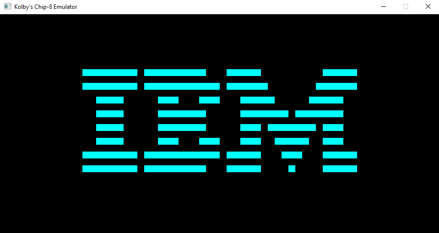

# Chip8 Emulator
A Chip8 Emulator written in C++ using the SDL2 library

# Install
Windows binaries are available for download in the releases section for unix compile instructions will be below

### Install packages
#### Arch-Linux
$ `sudo pacman -S sdl2 cmake`
#### Debian
$ `sudo apt-get install libsdl2-dev cmake`
#### Mac OS
$ `brew install sdl2 cmake`

### Clone and compile
$ `git clone https://github.com/KolbyML/chip8-emulator.git`

$ `cd chip8-emulator`

$ `cmake --configure .`

$ `cmake --build .`

Congratz 🥳🎉🎉

# Usage
Drag and drop a chip8 rom onto chip8-emulator.exe

or in the terminal run

``./chip8-emulator <rom location> <optional args etc (--help, --debug)>``

# Resources
[High-level guide to making a CHIP-8 emulator](https://tobiasvl.github.io/blog/write-a-chip-8-emulator)

[CHIP-8 technical reference](https://github.com/mattmikolay/chip-8/wiki/CHIP%E2%80%908-Technical-Reference)

[CHIP-8 instruction set](https://github.com/mattmikolay/chip-8/wiki/CHIP%E2%80%908-Instruction-Set)
